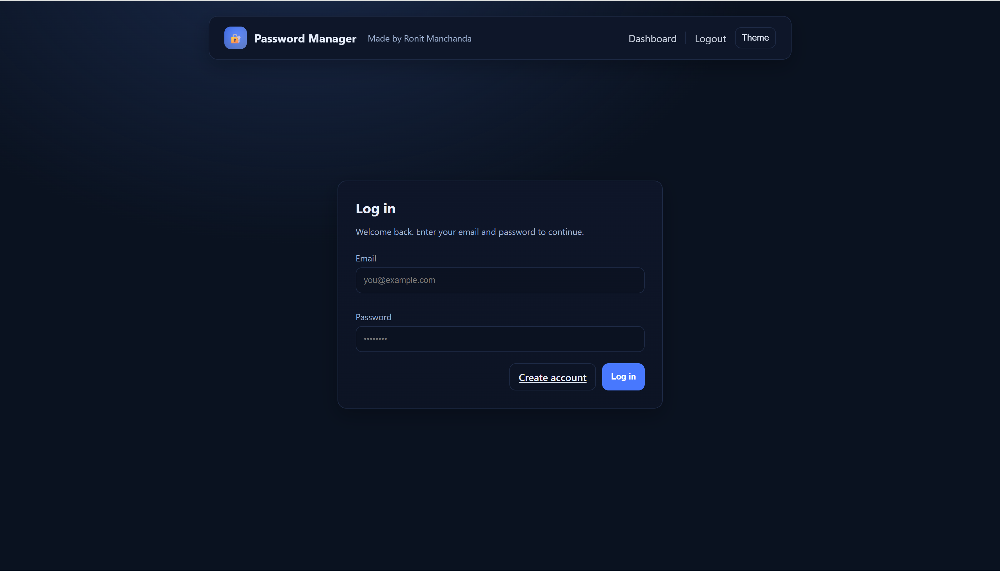
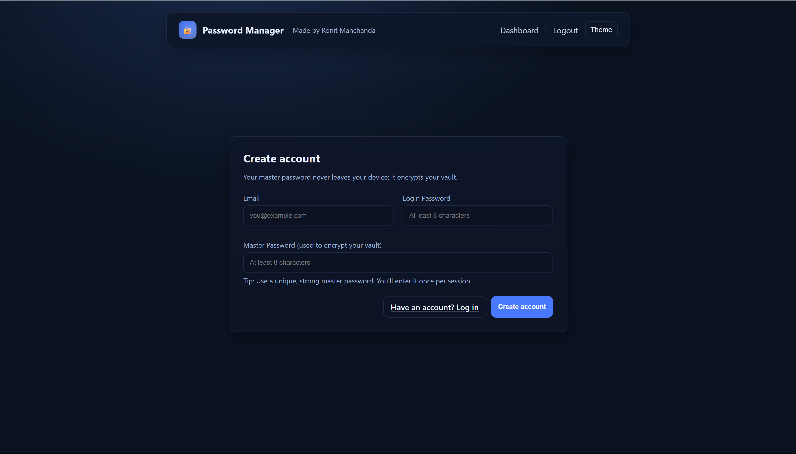
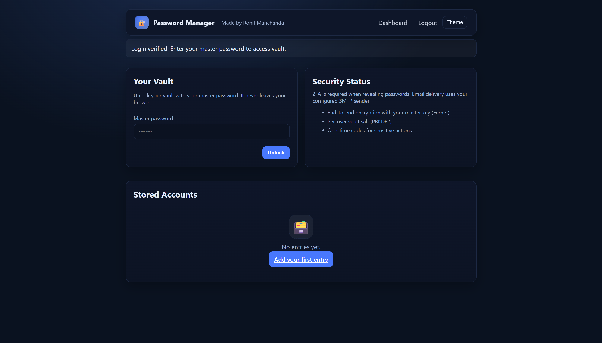
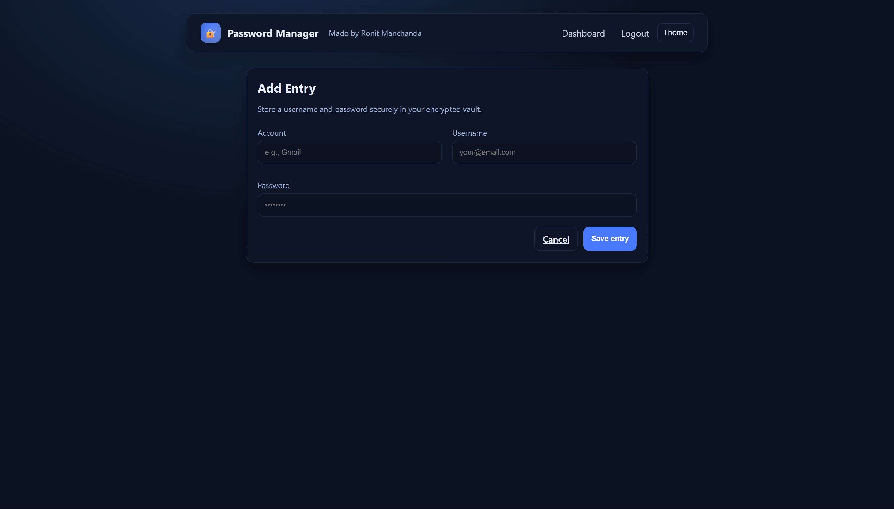

# Password Manager Web App

A secure and user-friendly web application for storing and managing your passwords — complete with encryption and two-factor authentication (2FA).  
Built using **Python (Flask)**, **PostgreSQL**, and deployed on **Render**.

---

## Live Demo
**[Click here to view the live app](https://password-manager-web-m8uv.onrender.com/)**

---

## Features

- **Secure Vault** – All stored passwords are encrypted using AES-256.
- **Two-Factor Authentication (2FA)** – Email-based verification before revealing stored passwords.
- **User Accounts** – Register and log in securely with hashed passwords.
- **Master Password** – Used to encrypt/decrypt your personal vault.
- **Add / View / Delete Entries** – Manage accounts, usernames, and passwords.
- **Responsive UI** – Works on desktop and mobile devices.
- **Deployed to the Cloud** – Hosted on Render for easy access anywhere.

---

## Screenshots

### Login Page


### Register Page


### Dashboard


### Add Entry


---

## Tech Stack

- **Backend:** Python (Flask)
- **Database:** PostgreSQL + SQLAlchemy ORM
- **Frontend:** HTML, CSS (custom styling)
- **Security:** AES-256 encryption, `cryptography` library, Flask-WTF for form validation
- **Deployment:** Render (Gunicorn WSGI server)
- **Email Sending:** SMTP (email-validator, smtplib)

---

## Project Structure
```
password_manager_web/
│
├── assets/                     # Live demo screenshots
│   ├── add_entry.png
│   ├── dashboard.png
│   ├── login1.png
│   └── register.png
│
├── static/
│   └── css/
│       └── style.css           # Custom styling for the app
│
├── templates/                  # HTML templates for Flask
│   ├── add_entry.html
│   ├── base.html
│   ├── dashboard.html
│   ├── login.html
│   ├── register.html
│   └── reveal.html
│
├── app.py                      # Main Flask application
├── crypto_util.py              # Encryption and decryption utilities
├── models.py                   # Database models
│
├── Procfile                    # Deployment configuration for Render
├── README.md                   # Project documentation
├── render.yaml                 # Render-specific deployment settings
├── requirements.txt            # Python dependencies
├── runtime.txt                 # Python runtime version
└── .gitignore                  # Ignored files for Git
```

